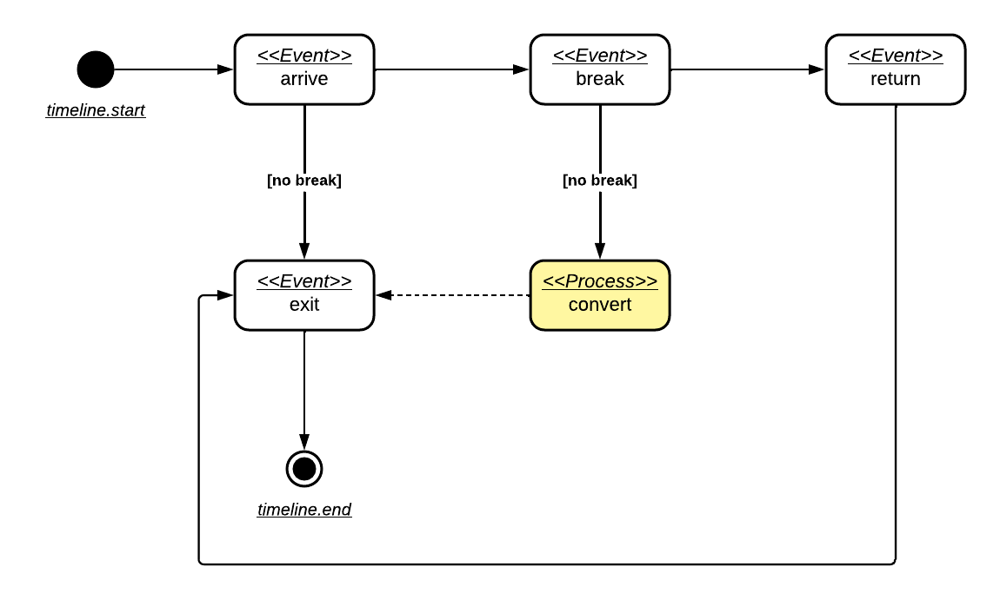
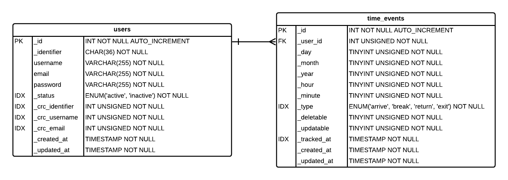

# Time Tracking App

This application stores the exact time for a work event for each user. These users can control their data.

## Event tracking

There are four possible events for tracking, they are:

- Arrive: the time of the day when the user started to work;
- Break: the time of the day when the user gives a break to work;
- Return: the time of the day when the user back to work after a break;
- Exit: the time of the day when the user exited from work.

Each of these events can happen only once a day. It also means there is a business logic to interpret them. And it must follow the rules:

- An arrive event starts the timeline and can be followed by a break or an exit event;
- A break can be followed by a return or an exit event, but when followed by an exit event it must be updated and converted to an exit event;
- An return event can be followed only by an exit event;
- An exit event closes the timeline.

There are also general rules that must be applied:

- Any time a user registers an event, he must confirm the date/hour from that event. The registered event must follow the timeline and its date must be greater than the last registered event;
- For events that can be updated only the date can change, but it cannot be less than the previous event date or greater than the next event date;
- To events that can be deleted, events around it must be adjusted.
- An user cannot delete an arrive or exit event;
- An user can delete a break event, however, the following return event will be canceled as well;
- An user can delete a return event, however, the exit event will merge with the break event or, if there is no exit event, the break event must be converted to an exit event.

## Statistics

A user can see all data statistics based on a daily or monthly journey. It must follow the requirements below:

- On a daily scale, the sum of hours at work and hours at break are displayed by day;
- On a monthly scale, the sum by month and the average by day are shown;
- For both a detailed table is shown by displaying: time of arrival, time of break, time of return, time of exit, and journey in hours.

## Data Storage

The database chosen to store data is MySQL. User profile data and user tracked events are stored into two different tables. See schemas details below:

- [Users](./schema/users.yaml);
- [Time Events](./schema/time_events.yaml).

> You must run migrations. See [database documentation](../database).

## Architecture

This application consists of three components:

- **Global API**: a RESTFUL API interface for a user be able to manage his data;
- **Public Proxying**: an interface to handle the authorization to Global API e parse user credentials before sending them to Global API;
- **Public Interface**: a REACT interface to users manage their data.

### Global API

_Details soon_.

### Public Proxying

_Details soon_.

### Public Interface

_Details soon_.